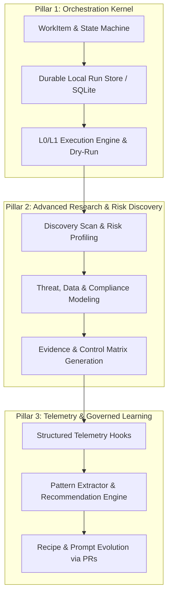

# 🚀 AutoForge 0.5.0 Master Development Plan (Enhanced)

> **Strategic Direction:** Reliable Orchestration Kernel & Risk-Aware Discovery First, Governed Learning Second.  
> **Core Objective:** Evolve AutoForge into a durable, accountable, and self-sufficient multi-agent SDLC engine for Node.js projects.

---

## 🏗️ Architectural Overview & Strategic Sequence

Following comprehensive architecture reviews and production-readiness assessments, AutoForge 0.5.0 is structured into three clear pillars:



---

## 🎯 0.5.0 Milestone Roadmap

### Pillar 1: Foundation & Durable Orchestration Kernel (Weeks 1–3)

_Goal: Move from ad-hoc prompt coordination to an auditable, recoverable execution kernel._

- [ ] **Milestone 1.1: Core Domain Schemas**
  - Define strictly typed, versioned contracts: `WorkItem.v1`, `Run.v1`, `Step.v1`, `Decision.v1`, `GateResult.v1`, and `Approval.v1`.
  - Establish clear state-transition rules (`Draft` → `Ready for Planning` → `Plan Review` → `Ready to Build` → `Building` → `Verify` → `Release Candidate` → `Awaiting Approval` → `Released`).
- [ ] **Milestone 1.2: Local Durable Run Store**
  - Implement a zero-config, embedded SQLite database located at `.autoforge/runtime/autoforge.db`.
  - Provide transactional run-state management, event logging, lock coordination, and mid-execution `resume` / `cancel` capabilities.
- [ ] **Milestone 1.3: Supervised L0/L1 Execution Engine & CLI Surface**
  - Implement `autoforge autopilot --dry-run` to expand recipes into deterministic DAGs without writing code.
  - Implement `autoforge autopilot --level 1` with sandboxed file mutations and mandatory human approval gates for high-risk actions (dependencies, schema migrations, production releases).
  - Implement `autoforge status [run-id]` for real-time progress and blocked gate visualization.

---

### Pillar 2: Advanced Research & Production Readiness Layer (Weeks 4–5)

_Goal: Proactively discover hidden security, privacy, data governance, and compliance obligations before code generation._

- [ ] **Milestone 2.1: Intake Discovery & Risk Profiler**
  - CLI: `autoforge research scan` to infer application domain, public exposure, authentication models, and data sensitivity.
  - Generate canonical planning artifacts: `APPLICATION_RISK_PROFILE.md` and `DATA_INVENTORY.yaml`.
- [ ] **Milestone 2.2: Threat Modeling & Standards Mapping**
  - Integrate proactive checks inspired by NIST AI RMF, OWASP ASVS, WCAG 2.2, and GDPR data minimization principles.
  - Generate `THREAT_MODEL.md`, `ACCESSIBILITY_PLAN.md`, and `CONTROL_MATRIX.yaml`.
- [ ] **Milestone 2.3: Readiness Gates & Work Item Synthesis**
  - CLI: `autoforge readiness check` to ensure all risk controls are mapped to actionable `WorkItem` tasks with assigned evidence requirements before building commences.

---

### Pillar 3: Telemetry, Observability & Governed Learning (Weeks 6–7)

_Goal: Capture empirical execution telemetry and provide safe, recommendation-based continuous improvement._

- [ ] **Milestone 3.1: Structured Telemetry Hooks**
  - Attach non-intrusive lifecycle observers (`onAgentStart`, `onGateEvaluate`, `onApprovalDecided`, `onAgentComplete`).
  - Stream events to `.autoforge/training/telemetry.jsonl` with token counts, gate retry statistics, error traces, and human intervention logs.
- [ ] **Milestone 3.2: Pattern Extraction & Suggestion Engine**
  - CLI: `autoforge train --from-last-N-projects <N>`.
  - Offline pattern analyzer detects recurring gate failures and produces suggested prompt/recipe diffs for human review (governed learning rather than unvalidated self-modification).
- [ ] **Milestone 3.3: Metrics & Reporting Dashboard**
  - CLI: `autoforge metrics` to display first-pass gate pass rates, average human intervention minutes, retry ratios, and token efficiency trends.

---

## 📋 Technical Blueprint: The Orchestration Kernel & Research Integration

### 1. Work Item & Run Schema (`src/core/types/orchestration.ts`)

```typescript
export type WorkItemState =
  | "draft"
  | "ready_for_planning"
  | "plan_review"
  | "ready_to_build"
  | "building"
  | "verify"
  | "release_candidate"
  | "awaiting_approval"
  | "released"
  | "blocked"
  | "cancelled";

export interface WorkItem {
  id: string; // e.g. "WI-2026-001"
  title: string;
  objective: string;
  riskTier: "R0" | "R1" | "R2" | "R3";
  state: WorkItemState;
  owner: string; // Accountable human or agent
  acceptanceCriteria: string[];
  linkedArtifacts: string[];
  createdTimestamp: number;
  updatedTimestamp: number;
}

export interface RunState {
  runId: string;
  workItemId: string;
  recipeName: string;
  autonomyLevel: 0 | 1 | 2 | 3;
  currentStepId?: string;
  status: "running" | "paused_approval" | "completed" | "failed" | "cancelled";
  evidence: Record<string, string>; // Gate -> artifact/log hash
}
```

### 2. Execution Flow with Research & Governance

```text
1. Developer / CLI: autoforge autopilot --level 1 --task "Add Stripe Checkout"
2. Intake Engine:
   ├── Creates WorkItem WI-042
   ├── Triggers Discovery Scan -> Produces APPLICATION_RISK_PROFILE.md (Risk Tier: R2)
   └── Generates DATA_INVENTORY.yaml & THREAT_MODEL.md
3. Gate Check (Research Completeness):
   └── Validates that payment security & webhook reconciliation controls are defined.
4. Planning & Construction (DAG Execution via SQLite run store):
   ├── Architect drafts OpenAPI & DB migration
   ├── Engineer generates code in isolated branch / worktree
   └── Quality Gates evaluate (Lint, Typecheck, Unit Tests, OWASP ASVS checks)
5. Human Approval Gate:
   └── Pauses at 'awaiting_approval' for production deployment & Stripe API keys.
6. Post-Run Telemetry:
   └── Emits execution trace to telemetry.jsonl for future prompt/recipe optimization.
```

---

## 🏁 Definition of Done for AutoForge 0.5.0

1. **Truthful CLI Surface:** Every command documented in help/README is functional or explicitly flagged with a preview banner.
2. **Durable Local Execution:** Runs can pause, safely resume after interruptions, and recover exact state via SQLite.
3. **Proactive Risk Discovery:** `autoforge research scan` uncovers data/security obligations before code writing.
4. **Governed Human Approvals:** High-risk actions (migrations, secrets, releases) cannot be bypassed autonomously without explicit signed approval records.
5. **Continuous Telemetry & Governed Learning:** Telemetry captures every gate attempt, and `autoforge train` emits reviewable prompt/recipe improvement suggestions.
