# 🚀 AutoForge 0.6.0 Master Plan — CI/CD, Compliance & Process Hardening

> **Focus:** Hardening CI/CD, Shift-Left Security & SOC 2 / ISO 27001 Audit Readiness  
> **Basis:** [dev/AutoForge_Compliance_Blueprint.md](file:///Users/coltonajackson/Code/Freelancing/cojacklabs/autoforge/dev/AutoForge_Compliance_Blueprint.md)

---

## 🏗️ Architectural Overview (2026 Compliant SDLC)

AutoForge 0.6.0 enhances the framework to turn AI-assisted development into an **audit-ready delivery engine** by mapping strict gate checks and machine-enforceable policies across all 7 SDLC phases:

```mermaid
graph TD
    subgraph SDLC Gate Sequence
        P1[1. Plan & Feasibility] -->|Spec Gate| P2[2. Requirements & Traceability]
        P2 -->|Design Gate: Threat Model / OpenAPI| P3[3. Architecture & Security Design]
        P3 -->|Build Gate: Pre-commit / SAST| P4[4. Development & Clean Code]
        P4 -->|Test Gate: Coverage Floor / E2E| P5[5. Testing & Validation]
        P5 -->|Change Gate: 2-Stage Approval / Rollback Plan| P6[6. Release & Deployment]
        P6 -->|Monitor Gate: Telemetry / Post-Mortem| P7[7. Maintenance & Observability]
    end
```

---

## 🎯 0.6.0 Milestone Roadmap

### Pillar 1: Shift-Left Security & CI/CD Hard Quality Gates

- [ ] **Milestone 1.1: Quality Gate Manifest & Hard Checks (`quality_gates.yaml`)**
  - Implement configurable thresholds in `devops/quality_gates.yaml`:
    - Code coverage floor (e.g. min 80% coverage, 0 negative delta).
    - Secret scanning gate (e.g. detect API keys, tokens, credentials).
    - SAST / Security linting gate (OWASP Top 10 rules).
    - Dependency vulnerability CVSS ceiling (block if CVSS ≥ 7.0).
- [ ] **Milestone 1.2: Enhanced `run_quality_gates.js`**
  - Update gate runner to execute: `parse` → `secret_scan` → `prettier` → `eslint` → `tsc` → `test_coverage` → `dependency_audit`.
  - Persist gate evaluation evidence directly to SQLite store & telemetry.
- [ ] **Milestone 1.3: GitHub Actions CI/CD Template Modernization**
  - Upgrade `devops/ci/web_app.yml` to modern 2026 standard with multi-job matrix: lint, typecheck, SAST scan, unit/integration test, coverage reporting, and SBOM generation.

---

### Pillar 2: Governance, Policies & Audit Evidence Layer

- [ ] **Milestone 2.1: Machine-Readable Policy Manifests (`.autoforge/policies/`)**
  - Add standard compliance policy templates:
    - `policies/software_development_policy.yaml` (SDLC stages & evidence rules).
    - `policies/change_management_policy.yaml` (2-stage approvals & emergency hotfix paths).
    - `policies/access_control_policy.yaml` (Least-privilege, environment isolation).
    - `policies/incident_response_plan.yaml` (Classification, escalation, post-mortem).
- [ ] **Milestone 2.2: Automated Evidence Repository (`evidence/`)**
  - Auto-generate timestamped audit evidence for every run:
    - Requirements traceability matrix (`evidence/traceability_matrix.json`).
    - Test execution & coverage reports (`evidence/test_reports/`).
    - Change ticket / PR approval records (`evidence/change_records/`).
    - Software Bill of Materials (`security/SBOM.json`).

---

### Pillar 3: Agent CI/CD Instructions & AI Prompt Enforcement

- [ ] **Milestone 3.1: Strict CI/CD Agent Prompts**
  - Update `ai/prompts/fullstack_engineer.yaml`, `ai/prompts/qa_engineer.yaml`, and `ai/prompts/devops_engineer.yaml` to enforce:
    - Conventional Commits with linked issue/CR IDs.
    - Zero unhandled secret leaks or hardcoded credentials.
    - Mandatory rollback plan in every deployment runbook.
    - Mandatory unit/integration test companion for all code changes.
- [ ] **Milestone 3.2: AI Onboarding & Guidance Manual**
  - Update `docs/ai/AGENT_AUTONOMY_GUIDE.md` and `docs/ai/COMMIT_PLAYBOOK.md` with explicit 7-phase gate progression rules.
  - Update `README.md` and `docs/AUTOFORGE_CLI_REFERENCE.md` with compliance commands (`autoforge audit`, `autoforge gate check`).

---

## 🏁 Definition of Done for AutoForge 0.6.0

1. **Shift-Left CI/CD Pipeline:** Modern GitHub Actions workflows validate quality gates (secrets, SAST, coverage, build).
2. **Audit-Ready Policies:** Complete set of machine-evaluable policy manifests in `.autoforge/policies/`.
3. **Automated Evidence Generation:** Every executed run generates structured evidence artifacts satisfying SOC 2 / ISO 27001 SDLC criteria.
4. **Strict Agent Prompting:** Coding and DevOps agents adhere to Conventional Commits, test floors, and rollback plans without manual human reminding.
