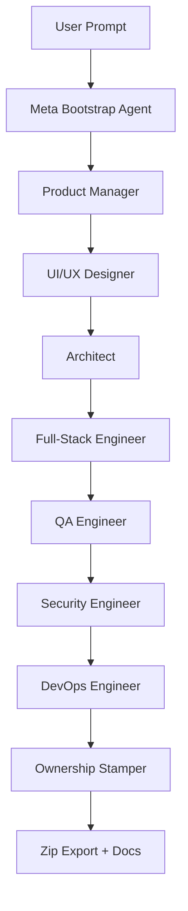

# AutoForge: The Freelancer-Replacement Framework

## Vision
A **zero-human SDLC seed**.  
Any user (dev, client, non-technical) gives a natural-language goal:

```text
Build a GIS-powered real-estate investment tracker for web + mobile, full-stack, secure.
```


AutoForge spins up a **multi-agent team** that:

1. **Plans** – PRD, user stories, edge cases.  
2. **Designs** – Figma JSON → React/Tailwind **or** Flutter.  
3. **Blueprints** – Prisma schema, OpenAPI, caching, mobile DB.  
4. **Codes** – Front-end, back-end, live AI agent that answers user prompts.  
5. **Tests** – Lint, unit, E2E, quality-gate validation.  
6. **Deploys** – Dockerfile, CI, runbooks.  
7. **Stamps IP** – Watermarks code/docs with client ID, exports a clean zip.

All **model-agnostic** – swap Claude ↔ Gemini ↔ Grok without rewriting prompts.

---

## Core Innovations

| Feature | How it works |
|---------|--------------|
| **Universal Blueprinting** | Dynamic JSON/YAML schemas stored in a tiny vector DB (`.autoforge/db/`). Every run indexes new designs; next model re-uses them instantly. |
| **Figma-to-Code Bridge** | UI/UX agent calls Figma REST API → structured JSON → maps to Shadcn, Tailwind, or Flutter widgets. No manual translation. |
| **Live AI Tenant** | Generates an in-app agent that pulls external APIs, caches to metadata DB, replies in real time. |
| **Model-Portability Engine** | `meta_bootstrap.yaml` wrapper adapts syntax (XML, function-calls, plain) for any LLM. |
| **IP Safety** | Final “Ownership” agent injects client watermarks, LICENSE header, and export note. |

---

## High-Level Flow



# Quick Wins for ROSAI (or any project)

1. npx autoforge init inside repo.
2. Edit autoforge.config.json → codeTargets point to src/client, src/server, mobile/.
3. Add a recipe recipes/gis_investment.yaml.
4. Prompt: Add legalization stage with attorney CRM → full blueprint + Figma flow in minutes.

---

# Mindset for AI Agents

- Treat agents like interns – start with one stage, log everything in ai/logs/.
- Memory compounds – always read ACTIVE_MEMORY.yaml before acting.
- Never assume – ask the human if stuck.
- All planning stays inside .autoforge/; code writes only to code_targets.yaml paths.


---

